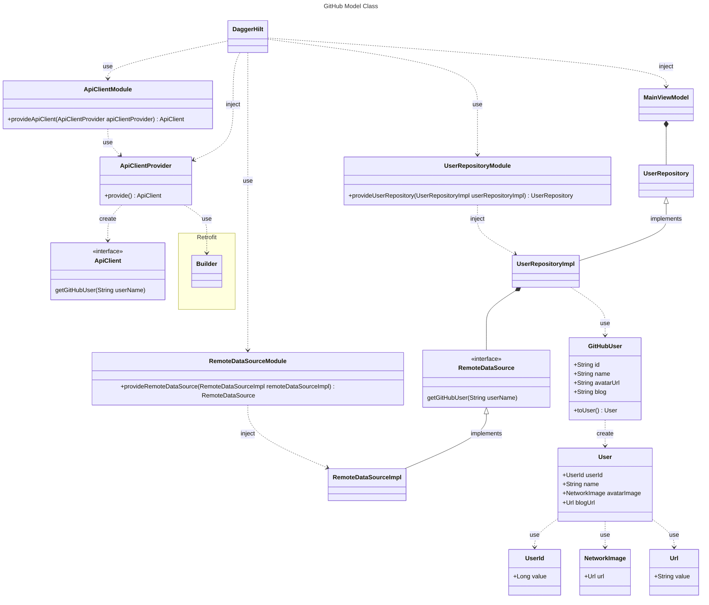

```mermaid
---
title: GitHub Model Class
---
classDiagram
    ApiClientProvider ..> ApiClient : create
    ApiClientProvider ..> Builder : use
    ApiClientModule ..> ApiClientProvider : use

    RemoteDataSource <|-- RemoteDataSourceImpl : implements
    RemoteDataSourceModule ..> RemoteDataSourceImpl : inject
    UserRepository <|-- UserRepositoryImpl : implements
    UserRepositoryImpl *-- RemoteDataSource

    DaggerHilt ..> ApiClientModule : use
    DaggerHilt ..> ApiClientProvider : inject
    DaggerHilt ..> RemoteDataSourceModule : use
    DaggerHilt ..> UserRepositoryModule : use
    UserRepositoryModule ..> UserRepositoryImpl : inject

    UserRepositoryImpl ..> GitHubUser : use
    GitHubUser ..> User : create
    User ..> UserId : use
    User ..> NetworkImage : use
    User ..> Url : use

    DaggerHilt ..> MainViewModel : inject

    MainViewModel *-- UserRepository
    
    namespace Retrofit {
        class Builder {
        }
    }

    class ApiClientProvider {
        +provide() ApiClient
    }

    class RemoteDataSourceModule {
        +provideRemoteDataSource(RemoteDataSourceImpl remoteDataSourceImpl) RemoteDataSource
        
    }

    class UserRepositoryModule {
        +provideUserRepository(UserRepositoryImpl userRepositoryImpl) UserRepository
        
    }

    class ApiClient{
        <<interface>> 
        getGitHubUser(String userName)
    }
    class ApiClientModule {
        +provideApiClient(ApiClientProvider apiClientProvider) ApiClient
    }


    class RemoteDataSource{
        <<interface>> 
        getGitHubUser(String userName)
    }


    class GitHubUser {
        +String id
        +String name
        +String avatarUrl
        +String blog
        +toUser() User
    }

    class User{
        +UserId userId
        +String name
        +NetworkImage avatarImage
        +Url blogUrl
    }
    class UserId{
        +Long value
    }
    class NetworkImage{
        +Url url
    }
    class Url{
        +String value
    }
```
